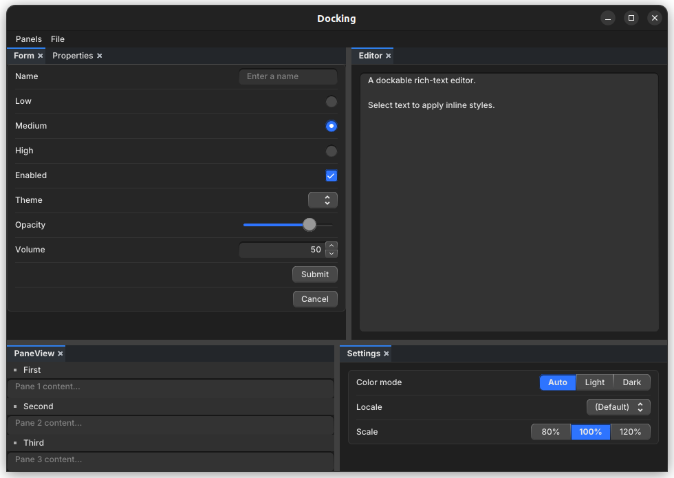
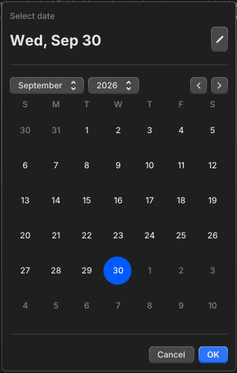

# guigui-widgets: library of reusable widgets for the [Guigui](github.com/guigui-gui/guigui) library

## dock

Complete docking system for complex and user-friendly UI, see [./example/dock](./example/dock/) and , see [./example/dock-locked](./example/dock-locked/)

## datepicker

3 kinds of widgets to pick dates, see [./example/datepicker](./example/datepicker/)

